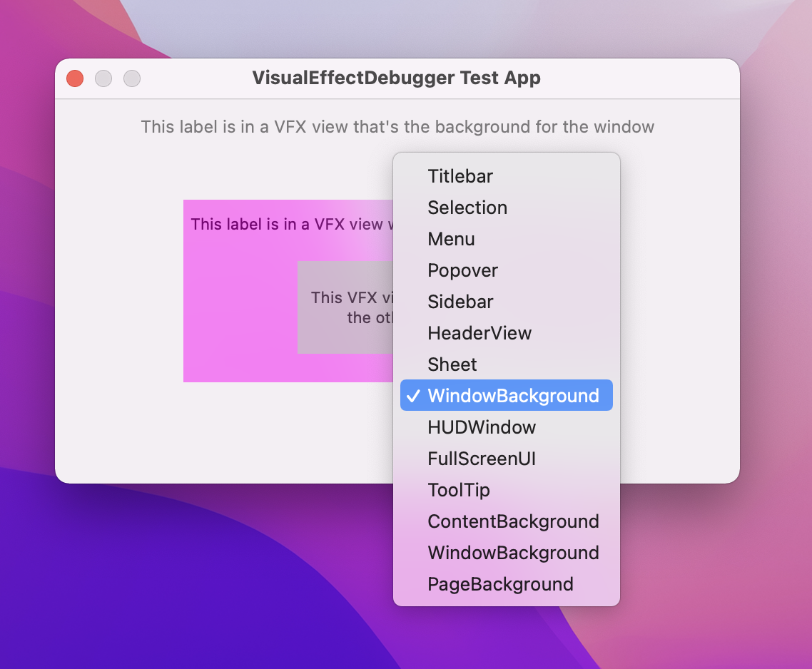
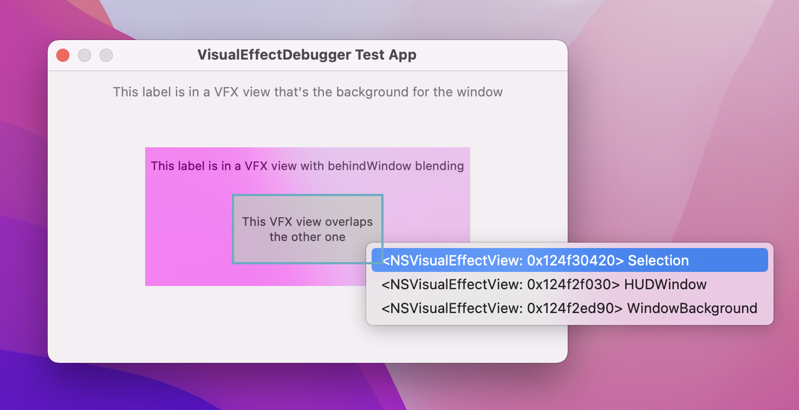

# VisualEffectDebugger

Simple debugger for `NSVisualEffectView`.
 
Just drop `VisualEffectDebugger.m` into your Xcode project and add `-AUIEnableVisualEffectDebugger YES` to your scheme's
"Arguments Passed on Launch" (or run `defaults write com.your.bundle.id AUIEnableVisualEffectDebugger YES` in Terminal).

When it's enabled, right-clicking any visual effect view in the app will show a menu where you can
toggle between the different materials.

If multiple visual effect views are overlapping, you can use the keyboard shortcut
Control + Option + Command + X with the cursor on top of the views to see a menu that
displays each visual effect view below the cursor and highlights the given view when
you hover over the menu item corresponding to that view.

**Disclaimers:**

- Made real quick just to accelerate my workflow while developing some UI stuff in my app
- Only tested in macOS Monterey 12.2 (but should work in previous versions)
- There are definitely bugs
- Please do not ship this in release builds of your app, that's why the whole code is within `#if DEBUG` / `#endif`

